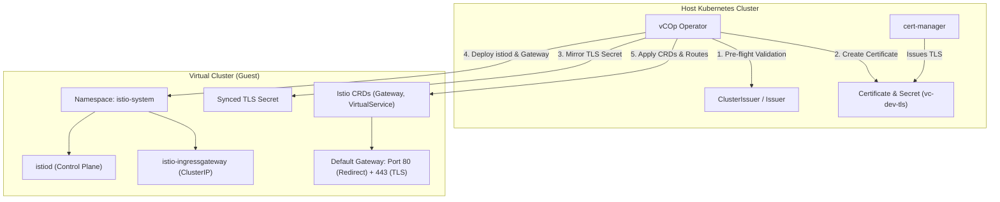

# vCluster Center of Operations (vCOp)

[](https://golang.org)
[](https://astro.build)
[](https://vcluster.com)
[](https://kubernetes.io)

An enterprise-grade, cloud-native **Virtual Cluster Management Platform** and Internal Developer Platform (IDP) designed to manage multi-tenant virtual clusters using **vCluster OSS v0.36**, high-availability etcd, internal CoreDNS, and metrics-server.

---

## Architecture Overview

vCOp couples a high-performance Kubernetes Operator with an ultra-responsive Astro SSR Operations Center dashboard:

```
                  ┌────────────────────────────────────────────────────────┐
                  │               Operations Center UI (Astro SSR)         │
                  │   - Dark-mode Cybernetic Glassmorphism Aesthetic       │
                  │   - 3-Step 1-Click Provisioning Wizard                 │
                  │   - Live Fleet Health Sparklines & Telemetry           │
                  │   - Instant Kubeconfig Download & CLI Connect Snippets │
                  └───────────────────────────┬────────────────────────────┘
                                              │ REST / CRD Mutations
                                              ▼
┌──────────────────────────────────────────────────────────────────────────────────────────┐
│                             Kubernetes Host Cluster (Control Plane)                      │
│                                                                                          │
│  ┌────────────────────────────────────────────────────────────────────────────────────┐  │
│  │                    vCOp Kubernetes Operator (Controller-Runtime)                   │  │
│  │   - Custom Resource: VirtualCluster (vops.gitops.io/v1alpha1)                      │  │
│  │   - Admission Webhook: Safe Minor Version Upgrades & Schema Validation             │  │
│  │   - Finalizer (vops.gitops.io/finalizer): Graceful Teardown & PVC Retention Cleanup│  │
│  └──────────────────────────────────────┬─────────────────────────────────────────────┘  │
│                                         │ Reconciles StatefulSets, Deployments, Secrets  │
│                                         ▼                                                │
│  ┌────────────────────────────────────────────────────────────────────────────────────┐  │
│  │                   Tenant Virtual Cluster (vCluster OSS v0.36)                      │  │
│  │                                                                                    │  │
│  │   ┌───────────────────────────────────┐    ┌───────────────────────────────────┐   │  │
│  │   │      High-Availability Backing    │    │      Virtual Kubernetes Syncer    │   │  │
│  │   │  - 3-Node Dedicated HA etcd       │◄───┤  - loft-sh/vcluster:0.36.x        │   │  │
│  │   │  - Peer Discovery (Port 2380)     │    │  - vcluster.yaml Unified Schema   │   │  │
│  │   │  - Client Listener (Port 2379)    │    │  - Workload Sync (Pods, Ingress)  │   │  │
│  │   │  - Persistent Volume Claims       │    │  - TLS Port 443 -> 8443           │   │  │
│  │   └───────────────────────────────────┘    └─────────────────┬─────────────────┘   │  │
│  │                                                              │                     │  │
│  │                                    ┌─────────────────────────┴─────────────────┐   │  │
│  │                                    │           Isolated Add-ons                │   │  │
│  │                                    │  - CoreDNS (Intra-cluster DNS)            │   │  │
│  │                                    │  - Metrics-Server (kubectl top & HPA)     │   │  │
│  │                                    └───────────────────────────────────────────┘   │  │
│  └────────────────────────────────────────────────────────────────────────────────────┘  │
└──────────────────────────────────────────────────────────────────────────────────────────┘
```

---

## Key Capabilities

### 1. vCluster OSS v0.36 Unified Engine
- Generates and enforces the unified `vcluster.yaml` schema introduced in v0.36.x.
- Zero external database dependencies: all state resides in native Kubernetes `CustomResources`, `ConfigMaps`, and `Secrets`.

### 2. High-Availability Backing Store (3-Node Quorum etcd)
- Automatically deploys a dedicated 3-replica etcd StatefulSet (`controlPlane.backingStore.etcd.deploy.statefulSet.highAvailability.replicas: 3`).
- Configures automated headless peer discovery and quorum health gating before control-plane readiness is asserted.

### 3. Opinionated Core Add-ons & Ingress Entrypoint
- **CoreDNS:** Enabled inside the virtual control plane for independent intra-vcluster service discovery without host DNS pollution.
- **Kubernetes Metrics Server:** Integrated inside the virtual cluster (`integrations.metricsServer.enabled: true`), allowing `kubectl top` and HPA controllers to function seamlessly within tenant boundaries.
- **Istio Application Entrypoint (`charts/vcluster-istio`):**
  - High-performance ingress powered by in-cluster `istiod` and `istio-ingressgateway`.
  - Service mesh is optional and disabled by default (`meshEnabled: false`) to preserve lightweight isolation.
  - Automatic HTTP-to-HTTPS upgrade: Gateway terminates port 80 and redirects traffic cleanly to port 443 with TLS.
  - Pre-configured `main-entrypoint` VirtualService routing traffic to tenant services for cluster FQDN hosts.

### 4. Robust Cert-Manager TLS Integration (Fail-Closed)
- Operator interfaces with host-level cert-manager `Issuer` or `ClusterIssuer` resources.
- **Fail-Closed Guardrails:** If the specified issuer is missing from the host cluster, admission webhooks reject creation and operator reconciliation aborts deployment immediately with a `Degraded` phase, preventing zombie clusters.
- **Pre-Creation Warning:** Operations Center UI inspects host cert-manager APIs in real time, alerting users to missing issuers before cluster provisioning starts.
- **TLS Secret Mirroring:** Certificates requested on the host cluster are securely mirrored into the guest `istio-system` namespace.

### 5. Built-in Observability & Metrics (No Grafana Required)
- Dedicated PostgreSQL backing store in `vcop-system` holding time-series telemetry.
- Historical CPU millicores and Memory working-set aggregation indexed by workload owner (`Deployment`, `StatefulSet`) so curves remain uninterrupted across pod name rollouts.
- Interactive SVG Bézier charts with crosshair scrubbing across 5 time horizons (`15m`, `1h`, `6h`, `24h`, `7d`).

### 6. Deterministic GitOps Interoperability
- Fully declarative Custom Resource Definitions (`VirtualCluster`).
- Compatible with Argo CD and Flux with zero controller drift fighting.

### 7. Safe Upgrade Sequencing & Admission Webhooks
- **vCluster Engine Upgrades:** Rolling update of syncer containers with pre-flight schema checks.
- **Kubernetes Upgrades:** Pre-flight etcd health check -> etcd snapshot checkpoint -> rolling API server upgrade -> add-on refresh.
- **Admission Webhooks & CEL:** Disallows downgrades, multi-minor version jumps (e.g. v1.29 to v1.31), and validates raw configuration blocks.

### 8. Operations Center UI (Astro SSR)
- **2026 Modern Minimalist Aesthetic:** Dark-mode first, glassmorphism surface panels, subtle cybernetic border glows, and high-contrast monospace accents.
- **1-Click Provisioning Wizard:** 4-step intuitive wizard abstracting all YAML and Kubernetes complexity for developers and QA testers.
- **Ingress & Istio Configuration Modal:** Instant management of gateway hosts, TLS secrets, and issuer settings.
- **Instant Kubeconfig & CLI Access:** Single-click download and live CLI connect command generator.
- **Telemetry Sparklines:** Real-time CPU and Memory utilization sparklines streamed directly from cluster telemetry.

### 9. Host Capacity Tracking & Overallocation Prevention Engine
- **Host Resource Discovery:** Continuously aggregates physical node metrics (`allocatable` and `capacity`) for CPU cores, RAM, and Ephemeral Storage across all host Kubernetes nodes.
- **Dynamic Fleet Quota Accounting:** Calculates requested resources, limits, and actual real-time utilization for every tenant `VirtualCluster` based on size presets, custom resources, and active `ResourceQuota` policies.
- **Deterministic Overallocation Guardrails:** Admission webhooks and pre-flight UI checks prevent provisioning virtual clusters or expanding resource quotas beyond available host headroom.
- **Condition `CapacityAvailable`:** Operator dynamically maintains the `CapacityAvailable` condition on each `VirtualCluster` CR, raising explicit `HostCapacityExceeded` events if node physical capacity is breached.
- **Administrator Bypass:** For non-production oversubscription testbeds, platform operators can bypass capacity validation via the annotation `vops.gitops.io/ignore-capacity-check: "true"` or the UI override toggle.
- **Dedicated Capacity Dashboard (`/capacity`):** Full telemetry dashboard showing host allocatable vs requested gauges, overcommit alert badges, and a granular tenant breakdown table.

---

## Helm Deployment & Automated Istio Management

### Do I need to deploy both `vcop` and `vcluster-istio` Helm charts?

> [!IMPORTANT]
> **No, you only need to deploy `charts/vcop`.**
>
> When you deploy the `vcop` Helm chart onto your host Kubernetes cluster, it installs the **vCOp Operator**, the **Operations Center UI**, and the **Metrics DB**. The operator then **natively reconciles, provisions, and manages Istio directly inside each virtual cluster**.
>
> You **do not** need to install `vcluster-istio` manually. The standalone [`charts/vcluster-istio`](charts/vcluster-istio) chart is provided as an optional reference/fallback package for teams wishing to deploy the opinionated Istio entrypoint stack manually or via GitOps (ArgoCD/Flux) on clusters without the vCOp operator.

```bash
# 1. Install the vCOp Operator & Operations Center UI on your host cluster
helm install vcop charts/vcop \
  --namespace vcop-system \
  --create-namespace

# 2. Access the Operations Center Dashboard (or configure ingress in values.yaml)
kubectl port-forward -n vcop-system svc/vcop-ui 4321:80
```

---

### How vCOp Installs and Manages Istio

When you enable Istio (via the **Operations Center UI** or by setting `spec.components.istio.enabled: true` in your `VirtualCluster` CR), the vCOp Operator's `IstioReconciler` automates the entire lifecycle:



#### Step-by-Step Lifecycle:

1. **Pre-Flight Cert-Manager Validation (Fail-Closed):**
   - The operator inspects the host cluster to verify that the configured `ClusterIssuer` or `Issuer` exists.
   - If the issuer is missing, reconciliation aborts immediately with a clear condition (`cert-manager issuer validation failed`), preventing broken endpoints.
2. **Automated TLS Issuance & Secret Mirroring:**
   - Creates a `cert-manager.io/v1` `Certificate` on the host cluster for the cluster's FQDN (e.g. `team-dev.example.com`).
   - Automatically mirrors the signed `kubernetes.io/tls` secret from the host namespace directly into the virtual cluster's `istio-system` namespace.
3. **In-Cluster Control Plane (`istiod`):**
   - Connects to the guest API server and ensures the `istio-system` namespace exists.
   - Deploys `istiod` (`docker.io/istio/pilot:<version>`) along with its ServiceAccount, ClusterRole, and ClusterRoleBindings.
   - Configures Pilot discovery and optional sidecar injection (`istio-injection: enabled/disabled`).
4. **Ingress Gateway (`istio-ingressgateway`):**
   - Deploys the Envoy-based ingress gateway proxy (`docker.io/istio/proxyv2:<version>`).
   - Configures a **`ClusterIP`** Service exposing port 80 (HTTP) and port 443 (HTTPS), avoiding expensive cloud load balancers and keeping traffic routing lean.
5. **CRDs, Gateway, & Routing:**
   - Installs Istio networking CRDs (`Gateways`, `VirtualServices`) inside the guest cluster.
   - Generates the root `Gateway` with automatic HTTP 80 -> HTTPS 443 redirection and HTTPS 443 TLS termination using the mirrored secret.
   - Generates the default `VirtualService` routing traffic to your application services.
6. **Zero-Downtime Rolling Upgrades:**
   - Whenever you upgrade Istio in the UI or update `spec.components.istio.version`, the operator rolls out new container images with zero downtime and reports the active version in `status.componentVersions`.

---

### Core Stack Upgrade Matrix

vCOp provides full dynamic version governance and zero-downtime rolling upgrades across all core components:

| Component | Default Version | Container Image Tag | Managed By |
|---|---|---|---|
| **Kubernetes CP** | `v1.31.0` | `registry.k8s.io/kube-apiserver:<tag>` | Syncer / Distro |
| **vCluster Engine** | `0.36.0` | `ghcr.io/loft-sh/vcluster:<tag>` | Operator Syncer |
| **etcd Backing Store** | `3.6.8-0` | `registry.k8s.io/etcd:<tag>` | Operator StatefulSet |
| **CoreDNS** | `v1.11.3` | `registry.k8s.io/coredns/coredns:<tag>` | Operator Addon |
| **Metrics-Server** | `v0.7.2` | `registry.k8s.io/metrics-server/metrics-server:<tag>` | Operator Addon |
| **Istio Control Plane & Gateway** | `1.24.2` | `docker.io/istio/pilot:<tag>` & `proxyv2:<tag>` | Operator IstioReconciler |

---

## Cluster Capacity Tracking & Overallocation Prevention

vCOp includes a real-time **Cluster Capacity Engine** and deterministic **Admission Guardrails** to track physical node capacity and prevent overcommitting the host Kubernetes cluster.

### How Capacity Tracking Works

```
┌────────────────────────────────────────────────────────────────────────┐
│                   Host Cluster Nodes (kubectl get nodes)               │
│   Allocatable:  CPU: 32 Cores   │   Memory: 30.97Gi   │   Disk: 1.9TB  │
└───────────────────────────────────┬────────────────────────────────────┘
                                    │
                  Aggregates Fleet Demand & Headroom
                                    ▼
┌────────────────────────────────────────────────────────────────────────┐
│                      vCOp Capacity Accounting Engine                   │
│                                                                        │
│   • VirtualCluster A (large):   16 Cores req  /  32Gi RAM              │
│   • VirtualCluster B (medium):   4 Cores req  /   8Gi RAM              │
│   ------------------------------------------------------------------   │
│   Fleet Total Requested:        20 Cores req  /  40Gi RAM              │
│   Host Headroom Remaining:      12 Cores rem  /   0Gi RAM (Overbooked) │
└───────────────────────────────────┬────────────────────────────────────┘
                                    │
                                    ▼
       ┌────────────────────────────┴───────────────────────────┐
       ▼                                                        ▼
┌──────────────────────────────┐        ┌──────────────────────────────┐
│  Admission Webhook / UI API  │        │   Operator Controller Status │
│                              │        │                              │
│  Blocks new provisioning or  │        │  Sets Condition:             │
│  quota hikes that exceed     │        │  CapacityAvailable: False    │
│  remaining host headroom.    │        │  Reason: HostCapacityExceeded│
└──────────────────────────────┘        └──────────────────────────────┘
```

### 1. Quota Calculation Model

The requested resources and limits for a virtual cluster are computed according to this deterministic hierarchy:

1. **Explicit ResourceQuota Policies (`spec.policies.resourceQuota`):**
   - If `requestsCPU`, `requestsMemory`, or `requestsStorage` are defined in the governance policies, they take highest precedence.
2. **Custom Resources (`spec.customResources`):**
   - If specified, custom CPU, Memory, or Ephemeral Storage limits are applied.
3. **Size Presets (`spec.sizePreset`):**
   - `small` / `normal`: 1 Core req / 2Gi RAM req / 10Gi Storage req (Limit: 2 Cores, 4Gi RAM)
   - `medium`: 4 Cores req / 8Gi RAM req / 25Gi Storage req (Limit: 8 Cores, 16Gi RAM)
   - `large` / `ha`: 8 Cores req / 16Gi RAM req / 50Gi Storage req (Limit: 16 Cores, 32Gi RAM)

### 2. Deterministic Overallocation Prevention

- **Pre-Flight UI Guardrails:** When attempting to provision a virtual cluster in the UI Wizard or increasing tenant quota in the Quota Modal, vCOp evaluates the remaining host headroom. If the requested delta exceeds available host capacity, the operation is blocked with a clear warning:
  ```
  Host overallocation prevented: Requesting 2Gi Memory exceeds available cluster headroom (0B remaining of 30.97Gi allocatable).
  ```
- **Admission Webhook Validation:** If applying a `VirtualCluster` manifest directly via `kubectl` or GitOps (ArgoCD/Flux), the validating admission webhook (`pkg/webhook/validator.go`) intercepts the request and rejects any creation or update that breaches host allocatable resources.
- **Dynamic CR Condition:** If the host node allocatable capacity shrinks (e.g. node drain or cordon), the operator sets:
  ```yaml
  status:
    conditions:
      - type: CapacityAvailable
        status: "False"
        reason: HostCapacityExceeded
        message: "Memory overallocation: requesting 32Gi, but host cluster only has 30.97Gi available"
  ```
- **Administrator Bypass:** Platform administrators can intentionally oversubscribe host resources by supplying the annotation:
  ```yaml
  metadata:
    annotations:
      vops.gitops.io/ignore-capacity-check: "true"
  ```
  Or checking the **"Override Host Capacity Guardrail"** checkbox in the Operations Center UI.

### 3. Dedicated Capacity Telemetry Dashboard

Visit `/capacity` in the Operations Center UI to view:
- **Visual Progress Gauges:** Total vs Allocatable vs Requested vs Available for CPU, RAM, and Storage.
- **Overcommit Banners:** High-visibility alerts displaying exactly which resource is approaching or exceeding physical capacity.
- **Granular Fleet Breakdown:** Table listing all virtual clusters, their requested quotas, maximum limits, actual used resources, and overall host share percentage.

### 4. Telemetry REST API

vCOp exposes a real-time capacity API for platform automation and monitoring scripts:

```bash
# Query live host capacity, fleet requests, and available headroom
curl -s http://localhost:4321/api/cluster/capacity | jq .

# Test if a planned virtual cluster size fits within current cluster headroom
curl -s -X POST http://localhost:4321/api/cluster/capacity \
  -H "Content-Type: application/json" \
  -d '{"preset": "medium"}' | jq .
```

---

## Directory Layout

```
vc-operator/
├── Makefile                            # Root build, test, and deploy orchestration
├── README.md                           # Master documentation
├── deploy/                             # Production Kubernetes manifests
│   ├── crds/
│   │   └── vops.gitops.io_virtualclusters.yaml   # CRD with OpenAPI v3 & CEL validation
│   ├── rbac/
│   │   ├── service_account.yaml        # ServiceAccounts for operator and UI
│   │   ├── role.yaml                   # ClusterRoles with scoped RBAC
│   │   └── role_binding.yaml           # ClusterRoleBindings
│   ├── presets/
│   │   ├── dev-sandbox.yaml            # 2 vCPU / 4GB RAM / 5GB single-node preset
│   │   ├── qa-staging.yaml             # 4 vCPU / 8GB RAM / 10GB 3-node HA preset
│   │   └── gpu-isolated.yaml           # 8 vCPU / 32GB RAM / 50GB NVMe GPU preset
│   ├── operator.yaml                   # Operator controller Deployment
│   ├── ui.yaml                         # Astro Operations Center Deployment & Service
│   └── samples/
│       ├── dev_cluster.yaml            # Sample sandbox VirtualCluster
│       └── prod_cluster.yaml           # Sample HA production VirtualCluster
├── charts/
│   ├── vcop/                           # Official Helm v3 Packaging for Platform
│   └── vcluster-istio/                 # Dedicated Opinionated Istio & TLS Gateway Helm Chart
├── apps/
│   ├── vc-operator/                    # Go Kubernetes Operator
│   │   ├── api/v1alpha1/               # Go CRD type definitions & deepcopy
│   │   ├── controllers/                # Master reconciler, etcd, syncer, upgrades, istio
│   │   ├── pkg/vcluster/               # vCluster 0.36 vcluster.yaml generator & presets
│   │   ├── pkg/webhook/                # Admission webhook validation logic
│   │   ├── main.go                     # Operator entrypoint
│   │   ├── Makefile                    # Go build and test targets
│   │   └── Dockerfile                  # Multi-stage distroless build
│   └── ui/                             # Astro SSR Operations Center Dashboard
│       ├── src/
│       │   ├── components/             # React islands (Dashboard, Wizard, Modals, IstioModal)
│       │   ├── layouts/                # Astro base cybernetic layout
│       │   ├── pages/                  # SSR pages and REST API routes
│       │   └── lib/                    # K8s client, metrics-collector & metrics-db
│       ├── astro.config.mjs            # Astro SSR Node configuration
│       ├── tailwind.config.mjs         # Cybernetic dark palette & glow utilities
│       ├── package.json                # Dependencies
│       └── Dockerfile                  # Production runner container
```

---

## Quickstart

### Prerequisites
- Go 1.22+
- Node.js 20+ & npm
- Kubernetes cluster (v1.28+) or local dev environment

### 1. Run Tests Across the Go Operator
```bash
make test
```
*Executes all unit tests, config generator verification, admission webhook tests, and controller reconciliation tests.*

### 2. Run the Operations Center UI Locally
```bash
make dev-ui
```
Open [http://localhost:4321](http://localhost:4321) in your browser.

### 3. Build Production Artifacts
```bash
make build
```
Compiles `apps/vc-operator/bin/manager` and creates the Astro SSR production bundle in `apps/ui/dist`.

### 4. Deploy to Kubernetes
```bash
# 1. Apply CRD definitions
make deploy-crds

# 2. Apply RBAC and ServiceAccounts
make deploy-rbac

# 3. Apply standard cluster presets
make deploy-presets

# 4. Deploy Operator and Operations Center UI
make deploy
```

---

## Custom Resource Definition (`VirtualCluster`)

Example configuration with Opinionated Core Stack (CoreDNS, Metrics-Server, Istio Entrypoint, Cert-Manager TLS):

```yaml
apiVersion: vops.gitops.io/v1alpha1
kind: VirtualCluster
metadata:
  name: billing-feature-auth
  namespace: default
  annotations:
    vops.gitops.io/custom-endpoint: "billing.apps.example.com"
spec:
  clusterName: billing-feature-auth
  vclusterVersion: "0.36.0"
  kubernetesVersion: "v1.31.0"
  etcdVersion: "3.6.8-0"
  sizePreset: normal # small | normal | medium | large | ha
  highAvailability: false
  components:
    coreDNS:
      enabled: true
      version: "v1.11.3"
    metricsServer:
      enabled: true
      version: "v0.7.2"
    istio:
      enabled: true
      version: "1.24.2"
      certificateIssuer: "vcluster-ca-issuer"
      certificateIssuerKind: "ClusterIssuer" # ClusterIssuer | Issuer
      meshEnabled: false # optional service mesh
      hosts:
        - "billing.apps.example.com"
      ingressGateway:
        enabled: true
        serviceType: "ClusterIP"
  sync:
    pods: true
    services: true
    ingresses: true
  lifecycle:
    autoSleep: true
    ttlHours: 72
```

---

## Authors & Contributors

- **Juan Felix-Falcon** ([@jfelixfalcon](https://github.com/jfelixfalcon)) — *Creator & Lead Maintainer*
- **vCOp Authors & Open Source Community**

See [CONTRIBUTING.md](CONTRIBUTING.md) for local development, testing, and pull request guidelines, and [CONTRIBUTORS.md](CONTRIBUTORS.md) for contributor recognition. We warmly welcome community pull requests, bug fixes, and feature proposals!

---

## License & Open Source Freedom

[](https://opensource.org/licenses/Apache-2.0)

This project is truly open-source software licensed under the **[Apache License, Version 2.0](LICENSE)**.

### What does this mean?
- **Freedom to Use**: Anyone is free to deploy, run, and integrate vCOp commercially or privately with zero royalties.
- **Freedom to Modify**: You can adapt, refactor, fork, and enhance any part of the operator, UI, and Helm charts.
- **Freedom to Distribute**: You can redistribute original or modified versions of the codebase.
- **Patent Protection**: Includes an explicit patent grant protecting contributors and downstream users alike.

Copyright 2026 vCOp Authors (Juan Felix-Falcon). See [LICENSE](LICENSE) and [NOTICE](NOTICE) for full license terms.
