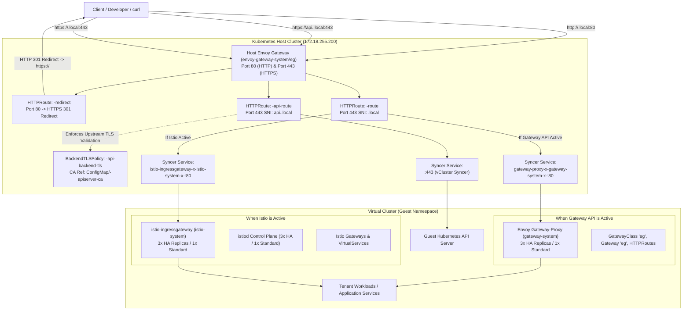
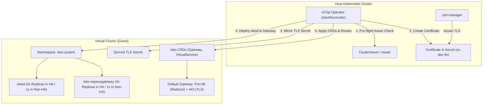
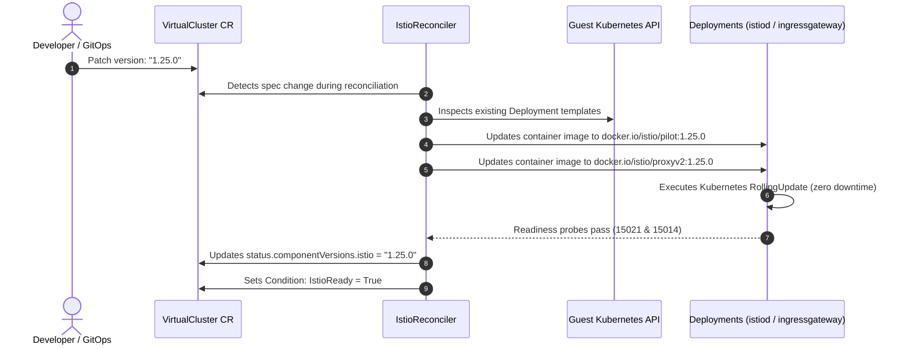
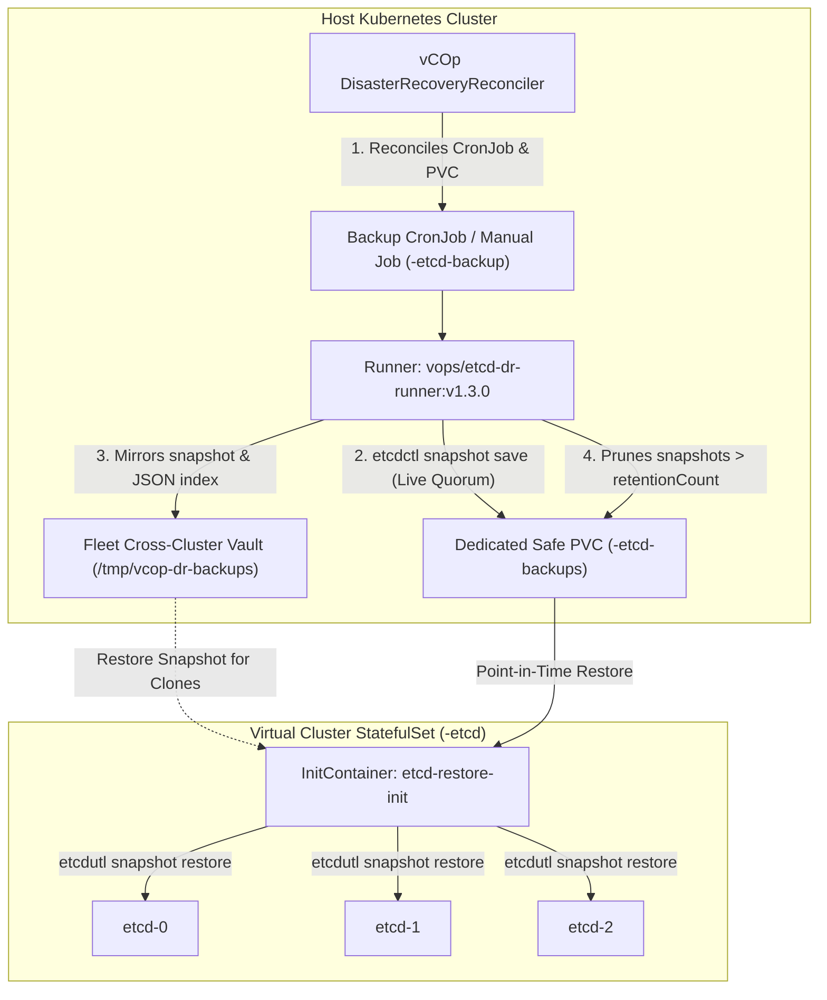

# vCluster Center of Operations (vCOp)

[](https://golang.org)
[](https://astro.build)
[](https://vcluster.com)
[](https://kubernetes.io)

An enterprise-grade, cloud-native **Virtual Cluster Management Platform** and Internal Developer Platform (IDP) designed to manage multi-tenant virtual clusters using **vCluster OSS v0.36**, high-availability etcd, internal CoreDNS, and metrics-server.

---

## Architecture Overview

vCOp couples a high-performance Kubernetes Operator with an ultra-responsive Astro SSR Operations Center dashboard:

```
                  ┌────────────────────────────────────────────────────────┐
                  │               Operations Center UI (Astro SSR)         │
                  │   - Dark-mode Cybernetic Glassmorphism Aesthetic       │
                  │   - 3-Step 1-Click Provisioning Wizard                 │
                  │   - Live Fleet Health Sparklines & Telemetry           │
                  │   - Instant Kubeconfig Download & CLI Connect Snippets │
                  └───────────────────────────┬────────────────────────────┘
                                              │ REST / CRD Mutations
                                              ▼
┌──────────────────────────────────────────────────────────────────────────────────────────┐
│                             Kubernetes Host Cluster (Control Plane)                      │
│                                                                                          │
│  ┌────────────────────────────────────────────────────────────────────────────────────┐  │
│  │                    vCOp Kubernetes Operator (Controller-Runtime)                   │  │
│  │   - Custom Resource: VirtualCluster (vops.gitops.io/v1alpha1)                      │  │
│  │   - Admission Webhook: Safe Minor Version Upgrades & Schema Validation             │  │
│  │   - Finalizer (vops.gitops.io/finalizer): Graceful Teardown & PVC Retention Cleanup│  │
│  └──────────────────────────────────────┬─────────────────────────────────────────────┘  │
│                                         │ Reconciles StatefulSets, Deployments, Secrets  │
│                                         ▼                                                │
│  ┌────────────────────────────────────────────────────────────────────────────────────┐  │
│  │                   Tenant Virtual Cluster (vCluster OSS v0.36)                      │  │
│  │                                                                                    │  │
│  │   ┌───────────────────────────────────┐    ┌───────────────────────────────────┐   │  │
│  │   │      High-Availability Backing    │    │      Virtual Kubernetes Syncer    │   │  │
│  │   │  - 3-Node Dedicated HA etcd       │◄───┤  - loft-sh/vcluster:0.36.x        │   │  │
│  │   │  - Peer Discovery (Port 2380)     │    │  - vcluster.yaml Unified Schema   │   │  │
│  │   │  - Client Listener (Port 2379)    │    │  - Workload Sync (Pods, Ingress)  │   │  │
│  │   │  - Persistent Volume Claims       │    │  - TLS Port 443 -> 8443           │   │  │
│  │   └───────────────────────────────────┘    └─────────────────┬─────────────────┘   │  │
│  │                                                              │                     │  │
│  │                                    ┌─────────────────────────┴─────────────────┐   │  │
│  │                                    │           Isolated Add-ons                │   │  │
│  │                                    │  - CoreDNS (Intra-cluster DNS)            │   │  │
│  │                                    │  - Metrics-Server (kubectl top & HPA)     │   │  │
│  │                                    └───────────────────────────────────────────┘   │  │
│  └────────────────────────────────────────────────────────────────────────────────────┘  │
└──────────────────────────────────────────────────────────────────────────────────────────┘
```

---

## Key Capabilities

### 1. vCluster OSS v0.36 Unified Engine
- Generates and enforces the unified `vcluster.yaml` schema introduced in v0.36.x.
- Zero external database dependencies: all state resides in native Kubernetes `CustomResources`, `ConfigMaps`, and `Secrets`.

### 2. High-Availability Backing Store (3-Node Quorum etcd)
- Automatically deploys a dedicated 3-replica etcd StatefulSet (`controlPlane.backingStore.etcd.deploy.statefulSet.highAvailability.replicas: 3`).
- Configures automated headless peer discovery and quorum health gating before control-plane readiness is asserted.

### 3. Opinionated Core Add-ons & Ingress Entrypoints
- **CoreDNS:** Enabled inside the virtual control plane for independent intra-vcluster service discovery without host DNS pollution.
- **Kubernetes Metrics Server:** Integrated inside the virtual cluster (`integrations.metricsServer.enabled: true`), allowing `kubectl top` and HPA controllers to function seamlessly within tenant boundaries.
- **Kubernetes Gateway API Entrypoint (`gateway.networking.k8s.io/v1`):**
  - Modern cloud-native ingress using official SIG-Network Gateway API CRDs (`GatewayClass`, `Gateway`, `HTTPRoute`).
  - Powered by in-cluster Envoy Gateway data plane (`gateway-system/gateway-proxy`).
  - **High Availability Sizing:** Automatically deploys **3 Envoy proxy replicas** in HA mode (`spec.highAvailability: true` or preset `ha`) for multi-node fault tolerance and zero-downtime routing, or 1 replica in standard mode.
  - Minimal resource overhead, zero sidecar complexity, and native Kubernetes declarative APIs.
- **Istio Application Entrypoint (`istio.io/v1beta1` / `charts/vcluster-istio`):**
  - High-performance ingress and service mesh powered by in-cluster `istiod` and `istio-ingressgateway`.
  - **Full High Availability Mode (3 Gateways & 3 istiod):** Automatically provisions **3 `istiod` control plane replicas** and **3 `istio-ingressgateway` edge replicas** in HA mode, or 1 replica each in non-HA mode.
  - Service mesh is optional and disabled by default (`meshEnabled: false`) to preserve lightweight isolation.
  - Automatic HTTP-to-HTTPS upgrade and pre-configured `main-entrypoint` routing.
- **Unified Host Ingress Architecture & Dynamic Multiplexing:**
  - Host Envoy Gateway (`envoy-gateway-system/eg` on `172.18.255.200`) dynamically routes both control plane traffic (`api.<cluster>.local`) and application traffic (`<cluster>.local`).
  - **Zero Host Reconfiguration:** Seamlessly toggle between Gateway API and Istio without modifying `/etc/hosts` or host infrastructure.
  - Automatic edge HTTP 80 -> HTTPS 443 redirection (`HTTPRoute/<cluster>-redirect`) prevents internal redirect loops.
  - Control plane proxying via `HTTPRoute/<cluster>-api-route` paired with `BackendTLSPolicy` referencing the cluster's CA ConfigMap directly to `svc/<cluster>:443`.

### 4. Robust Cert-Manager TLS Integration (Fail-Closed)
- Operator interfaces with host-level cert-manager `Issuer` or `ClusterIssuer` resources.
- **Fail-Closed Guardrails:** If the specified issuer is missing from the host cluster, admission webhooks reject creation and operator reconciliation aborts deployment immediately with a `Degraded` phase, preventing zombie clusters.
- **Pre-Creation Warning:** Operations Center UI inspects host cert-manager APIs in real time, alerting users to missing issuers before cluster provisioning starts.
- **TLS Secret Mirroring:** Certificates requested on the host cluster are securely mirrored into the guest `istio-system` namespace.

### 5. Built-in Observability & Metrics (No Grafana Required)
- Dedicated PostgreSQL backing store in `vcop-system` holding time-series telemetry.
- Historical CPU millicores and Memory working-set aggregation indexed by workload owner (`Deployment`, `StatefulSet`) so curves remain uninterrupted across pod name rollouts.
- Interactive SVG Bézier charts with crosshair scrubbing across 5 time horizons (`15m`, `1h`, `6h`, `24h`, `7d`).

### 6. Deterministic GitOps Interoperability
- Fully declarative Custom Resource Definitions (`VirtualCluster`).
- Compatible with Argo CD and Flux with zero controller drift fighting.

### 7. Safe Upgrade Sequencing & Admission Webhooks
- **vCluster Engine Upgrades:** Rolling update of syncer containers with pre-flight schema checks.
- **Kubernetes Upgrades:** Pre-flight etcd health check -> etcd snapshot checkpoint -> rolling API server upgrade -> add-on refresh.
- **Admission Webhooks & CEL:** Disallows downgrades, multi-minor version jumps (e.g. v1.29 to v1.31), and validates raw configuration blocks.

### 8. Operations Center UI (Astro SSR)
- **2026 Modern Minimalist Aesthetic:** Dark-mode first, glassmorphism surface panels, subtle cybernetic border glows, and high-contrast monospace accents.
- **1-Click Provisioning Wizard:** 4-step intuitive wizard abstracting all YAML and Kubernetes complexity for developers and QA testers.
- **Ingress & Istio Configuration Modal:** Instant management of gateway hosts, TLS secrets, and issuer settings.
- **Instant Kubeconfig & CLI Access:** Single-click download and live CLI connect command generator.
- **Telemetry Sparklines:** Real-time CPU and Memory utilization sparklines streamed directly from cluster telemetry.

### 9. Host Capacity Tracking & Overallocation Prevention Engine
- **Host Resource Discovery:** Continuously aggregates physical node metrics (`allocatable` and `capacity`) for CPU cores, RAM, and Ephemeral Storage across all host Kubernetes nodes.
- **Dynamic Fleet Quota Accounting:** Calculates requested resources, limits, and actual real-time utilization for every tenant `VirtualCluster` based on size presets, custom resources, and active `ResourceQuota` policies.
- **Deterministic Overallocation Guardrails:** Admission webhooks and pre-flight UI checks prevent provisioning virtual clusters or expanding resource quotas beyond available host headroom.
- **Condition `CapacityAvailable`:** Operator dynamically maintains the `CapacityAvailable` condition on each `VirtualCluster` CR, raising explicit `HostCapacityExceeded` events if node physical capacity is breached.
- **Administrator Bypass:** For non-production oversubscription testbeds, platform operators can bypass capacity validation via the annotation `vops.gitops.io/ignore-capacity-check: "true"` or the UI override toggle.
- **Dedicated Capacity Dashboard (`/capacity`):** Full telemetry dashboard showing host allocatable vs requested gauges, overcommit alert badges, and a granular tenant breakdown table.

### 10. etcd Disaster Recovery (DR) & Point-in-Time Backup/Restore Engine
- **Automated Granular Scheduling:** Configure backup cadences (`daily`, `weekly`, `monthly`, `custom`, or `disabled`) per virtual cluster via CRD or UI. The operator reconciles an automated Kubernetes `CronJob` (`<clusterName>-etcd-backup`) that executes live, consistent etcd snapshots.
- **Dedicated Safe Storage PVC Isolation:** Snapshots are written to a dedicated PersistentVolumeClaim (`<clusterName>-etcd-backups`) completely isolated from active etcd runtime volumes, with configurable PVC storage size (default 10Gi) and automatic retention count pruning (default 7 snapshots).
- **On-Demand "Backup Now":** Instant manual snapshot triggers via the Operations Center UI or REST API before risky migrations or schema modifications.
- **Deploying New Clusters Restored from Backup:** When provisioning a new virtual cluster via the UI Provisioning Wizard or GitOps, users can select any existing snapshot in the fleet (`spec.disasterRecovery.initialBackupRestore`) to initialize an exact clone.
- **Point-in-Time Rolling Restore on Existing Clusters:** Seamless cluster rollback support (`spec.disasterRecovery.restoreSnapshotName`). The operator mounts an `etcd-restore-init` container powered by `vops/etcd-dr-runner:v1.4.1` running `etcdutl snapshot restore` across all StatefulSet replicas with strict Raft log invariance and member identity integrity.
- **Disaster Recovery UI Tab:** Dedicated tab in Cluster Details with live vault metrics, snapshot history table, schedule modal, and a safe confirmation modal with destructive rollback warnings.

### 11. Embedded Offline AI Copilot (Gemma 3) & Cluster Action Engine
- **100% Sovereign & Offline Inference:** Powered by an in-cluster `llama.cpp` inference engine running Google's Gemma 3 1B IT model. Operates completely air-gapped without external API keys, tokens, or egress connections.
- **Dynamic Hardware & GPU Accelerator Detection:** Automatically discovers underlying host and node hardware (NVIDIA RTX/GeForce/Tesla/A100/H100 via CUDA, AMD Radeon/Instinct via ROCm, Intel) or dynamically falls back to high-throughput CPU multi-threading. Hardware metadata is dynamically synchronized to `ConfigMap/vcop-hardware-info` in `vcop-system` with zero hardcoding.
- **Real-Time Cluster Telemetry Querying:** Ask natural language questions regarding live Kubernetes cluster inventory, running pods, namespaces, node allocatable capacity, and virtual cluster health.
- **Cluster Operational Action Execution:** Directly execute operational commands through chat (e.g. *"Can you restart the keycloak-operator deployment for me?"* or *"Scale vcop-operator to 2"*). The AI extracts target workloads, verifies state against the Kubernetes API, executes rolling restarts via strategic merge patches, and renders rich interactive Cybernetic Action Cards with live replica verification and quick follow-ups.
- **Zero-Horizontal-Scroll Cybernetic Interface:** Built-in floating chat overlay at the bottom-right of the dashboard with instant suggestion chips, Markdown code rendering, and real-time streaming tokens.

### 12. 100% Air-Gapped & Sovereign Enterprise Distribution
- **Self-Contained Typography & Icons:** Self-hosted `Inter` and `JetBrains Mono` WOFF2 fonts and inline vector SVG icons (`lucide-react`) are bundled directly within the container images. Zero external CDN calls (`fonts.googleapis.com`, `cdnjs`, etc.).
- **Single-Command Airgap Packager:** `make airgap-pack` packages all container images (`vc-operator`, `vc-operations-center`, `etcd-dr-runner`, `vc-ai`, `postgres:16-alpine`), Helm charts, manifests, and loader scripts into a portable, verifiable `.tar.gz` bundle with cryptographic `SHA256SUMS`.
- **Automated Air-Gap Loader & Installer:** Dedicated scripts (`load-images.sh` and `install.sh`) supporting direct node runtime loading (Docker, Podman, nerdctl, containerd) and automated retagging/pushing to private corporate registries (Harbor, Nexus, Artifactory).

### 13. Enterprise App Catalog & Built-In GitOps Version Control System (VCS)
- **Eliminate External GitOps & ArgoCD / GitLab Dependencies:** vCOp replaces the need for external GitOps engines or code repositories to track catalog releases and manifest changes. vCOp acts as the single pane of glass for fleet operations, catalog curation, and tenant application lifecycles.
- **Full Revision History for Apps & Groups:** Every mutation to an application (Helm repo, chart version, inline YAML manifests, default values) or Application Group (version bump, app membership, version pin matrices) produces an immutable revision commit with cryptographic revision IDs, semantic version tagging, commit authoring, and audit logs.
- **Visual Line-by-Line Colored Diffing:** Interactive modal showing side-by-side or unified diffs for Helm values and Kubernetes manifests with green (+) addition and red (-) removal highlighting between any two revisions.
- **Group App Version Matrices:** Pin exact semantic versions of applications inside an Application Group. Track changes when individual apps within the group are upgraded, added, or removed.
- **Working Version Tagging (Golden Baseline):** Mark any revision as a verified "Known Working Version" (★) to ensure mission-critical baseline stability.
- **One-Click Fallback / Rollback:**
  - **Catalog-Level Rollback:** Instantly restore any past version of an application or group back to active status in the catalog.
  - **Cluster-Level Rollback:** Directly in the Cluster Details dashboard, view deployed application revision history, diff against the active deployment, and roll back running workloads to a previous known working state in one click.

### 14. Dedicated Embedded OCI Artifact & Helm Chart Registry Pod (`vcop-registry`)
- **Native OCI Distribution Spec v1.1:** Fully compliant OCI repository hosted directly within the `vcop-system` namespace on port 5000 (`vcop-registry.vcop-system.svc:5000`).
- **Store Containers, Helm Charts & OCI Artifacts:** Host private container images, `oci://` Helm packages, and arbitrary artifacts (Wasm, configuration bundles, ORAS artifacts) completely on-premise and air-gapped.
- **Persistent Storage & Zero-Configuration Deployment:** Backed by a dedicated 20Gi PVC (`vcop-registry-data`) with delete enabled, CORS support, and automatic deployment via the main `charts/vcop` Helm chart or `deploy/registry.yaml`.
- **Integrated OCI Repository Explorer UI:** In the Operations Center, inspect available repositories, tags, digests, and generated push/pull CLI commands for Helm, Docker/Podman, and ORAS.
- **1-Click "Deploy Chart as App":** Browse charts hosted in the internal OCI registry and instantly generate an App Store definition with a single click.

---

## Helm Deployment & Platform Installation

### Do I need to deploy both `vcop` and `vcluster-istio` Helm charts?

> [!IMPORTANT]
> **No, you only need to deploy `charts/vcop`.**
>
> When you deploy the `vcop` Helm chart onto your host Kubernetes cluster, it installs the **vCOp Operator**, the **Operations Center UI**, the **Metrics DB**, and the **Embedded OCI Registry (`vcop-registry`)**. The operator then **natively reconciles, provisions, and manages ingress entrypoints (Gateway API or Istio) directly inside each virtual cluster**.
>
> You **do not** need to install `vcluster-istio` manually. The standalone [`charts/vcluster-istio`](charts/vcluster-istio) chart is provided as an optional reference/fallback package for teams wishing to deploy the opinionated Istio entrypoint stack manually or via GitOps (ArgoCD/Flux) on clusters without the vCOp operator.

```bash
# 1. Install the vCOp Operator & Operations Center UI on your host cluster
helm install vcop charts/vcop \
  --namespace vcop-system \
  --create-namespace

# 2. Access the Operations Center Dashboard (or configure ingress in values.yaml)
kubectl port-forward -n vcop-system svc/vcop-ui 4321:80
```

---

### Air-Gapped & Disconnected Cluster Deployment

For disconnected, classified, or air-gapped environments without outbound internet access, vCOp provides a dedicated single-command packaging pipeline:

```bash
# 1. Package the complete standalone distribution bundle (on connected build station)
make airgap-pack
```

This generates `dist/vcop-airgap-bundle-v1.4.1.tar.gz` (containing all container images including the pre-baked Gemma 3 inference engine, Helm charts, manifests, and loader scripts).

In the air-gapped environment:
```bash
# 2. Extract the bundle
tar -xzf vcop-airgap-bundle-v1.4.1.tar.gz
cd vcop-airgap-bundle-v1.4.1

# 3. Load images into local runtime or push to your private enterprise registry
./scripts/load-images.sh --registry harbor.internal.corp/vops

# 4. Install vCOp (Helm or pure kubectl)
./scripts/install.sh --registry harbor.internal.corp/vops
```

> [!TIP]
> For detailed air-gap architecture guarantees, SHA256 verification steps, and pure manifest installation instructions, see the complete [AIRGAP.md Guide](AIRGAP.md).

---

## Ingress Architecture & Entrypoint Management: Gateway API & Istio

vCOp provides an enterprise-grade, dual-engine ingress architecture supporting both the modern **Kubernetes Gateway API standard** (via Envoy Gateway) and the **Istio Service Mesh**. Both options are dynamically orchestrated by the operator and multiplexed across a unified host gateway layer with zero host-level reconfiguration.

---

### Unified Host Ingress Architecture (Zero-Friction Dynamic Multiplexing)

In multi-tenant environments, managing edge routing for both control plane APIs and tenant workloads often leads to brittle DNS configurations and manual `/etc/hosts` changes whenever ingress tooling changes. vCOp solves this with an opinionated **Unified Host Ingress Architecture**:



#### Core Architectural Guarantees:

1. **Single Static DNS & IP (`172.18.255.200`):**
   - Host Envoy Gateway (`envoy-gateway-system/eg`) listens on a single LoadBalancer/MetalLB IP (`172.18.255.200`).
   - Platform users and developers only configure a single entry in `/etc/hosts` (or corporate DNS):
     ```text
     172.18.255.200 vcop.local keycloak.local vc-dev.local api.vc-dev.local
     ```
   - **Zero Host Reconfiguration:** When switching between Istio and Kubernetes Gateway API, developers and operators **never need to touch `/etc/hosts`**, reallocate IPs, or alter edge proxy settings. The operator reconciles the host `HTTPRoute` target backend dynamically.

2. **Dedicated Control Plane Ingress (`api.<cluster>.local`) via `BackendTLSPolicy`:**
   - Access to the virtual cluster's Kubernetes API server is routed through `https://api.<cluster>.local`.
   - The operator creates a host `HTTPRoute/<cluster>-api-route` pointing to the internal vCluster syncer Service (`svc/<cluster>:443`).
   - To prevent "Client sent an HTTP request to an HTTPS server" or TLS handshake failures, the operator automatically provisions a `BackendTLSPolicy` (`<cluster>-api-backend-tls`) and exports the vCluster's internal Certificate Authority into a host `ConfigMap` (`<cluster>-apiserver-ca`). Envoy Gateway initiates encrypted upstream TLS to the virtual API server and validates its certificate against the exported CA.

3. **Unified Edge HTTP-to-HTTPS Redirection:**
   - Ingress on port 80 is handled cleanly at the host edge by `HTTPRoute/<cluster>-redirect`, issuing an immediate HTTP 301 `RequestRedirect` to HTTPS 443 with TLS.
   - In-guest ingress proxies (both Envoy Gateway-Proxy and Istio Ingressgateway) serve plain HTTP on their internal port 80, preventing redirect loops between the host edge and tenant pods.

4. **Dynamic Provider Multiplexing & Decoupled Cleanup:**
   - When **Gateway API** is enabled: The operator points host routing to `gateway-proxy-x-gateway-system-x-<cluster>:80`.
   - When **Istio** is enabled: The operator points host routing to `istio-ingressgateway-x-istio-system-x-<cluster>:80`.
   - When an entrypoint option is disabled, the operator's teardown handler (`CleanupGuestGatewayAPI` or Istio teardown) cleans up in-guest deployments, services, and CRDs without impacting the host API server route (`api.<cluster>.local`).

---

### Ingress Provider Comparison: Gateway API vs. Istio

| Dimension | Kubernetes Gateway API (Envoy Gateway) | Istio Service Mesh & Ingress Gateway |
|---|---|---|
| **API Standard** | Official `gateway.networking.k8s.io/v1` (Kubernetes SIG-Network) | `istio.io/v1beta1` (Istio Project Custom Resources) |
| **Data Plane** | High-performance Envoy Proxy (`gateway-system/gateway-proxy`) | Envoy-based `istio-ingressgateway` (`istio-system`) |
| **Control Plane** | Lightweight host-integrated Envoy Gateway | In-guest `istiod` pilot discovery daemon |
| **Resource Footprint** | **Minimal (~60MB RAM)**; no in-guest control plane daemon | **Moderate (~350MB RAM)**; runs `istiod` and Envoy |
| **Service Mesh & Sidecars** | Pure Ingress; zero sidecar injection overhead | Optional Sidecars (`meshEnabled: true`); mTLS, L7 telemetry |
| **High Availability** | 3x Envoy Gateway-Proxy pods in HA; 1x in Non-HA | 3x `istiod` + 3x `istio-ingressgateway` in HA; 1x in Non-HA |
| **Primary Use Case** | Cloud-native microservices, standard declarative routing, low overhead | Enterprise microservices requiring zero-trust mTLS & policies |

---

### Option A: Kubernetes Gateway API Entrypoint Stack

When you enable Gateway API (via the Operations Center UI or by setting `spec.components.gatewayAPI.enabled: true`), the operator's `GatewayAPIReconciler` automates the entire lifecycle inside the guest and at the host edge:

#### 1. In-Guest Gateway API CRDs & Infrastructure
- The operator installs official Gateway API v1 CRDs (`GatewayClass`, `Gateway`, `HTTPRoute`, `BackendTLSPolicy`) inside the tenant cluster.
- A tenant-level `GatewayClass` named `eg` (`gateway.envoyproxy.io/gatewayclass-controller`) and a tenant `Gateway` named `eg` are provisioned in namespace `gateway-system`.
- In-guest Envoy Gateway-Proxy is deployed with readiness gating on `:19001/ready`.

#### 2. High Availability Sizing
- If `spec.highAvailability: true` (or `ha` preset), the operator provisions **3 Envoy proxy replicas** across host nodes for fault tolerance.
- Non-HA clusters deploy 1 replica to conserve resources.
- Teams can specify exact custom replica counts using `spec.components.gatewayAPI.replicas`.

#### 3. In-Guest Application Routing
- A default in-guest `HTTPRoute` named `main-entrypoint` routes traffic matching `spec.components.gatewayAPI.hosts` to tenant application services on port 80.
- Decoupled cleanup: Disabling Gateway API triggers `CleanupGuestGatewayAPI`, cleanly removing in-guest proxies while preserving cluster uptime.

---

### Option B: Istio Entrypoint Stack & Service Mesh

When you enable Istio (via the **Operations Center UI** or by setting `spec.components.istio.enabled: true` in your `VirtualCluster` CR), the vCOp Operator's `IstioReconciler` automates the entire lifecycle:



#### Step-by-Step Reconciliation Pipeline

1. **Pre-Flight Cert-Manager Validation (Fail-Closed):**
   - The operator inspects the host cluster to verify that the configured `ClusterIssuer` or `Issuer` exists.
   - If the issuer is missing, reconciliation aborts immediately with a clear condition (`cert-manager issuer validation failed`), preventing broken endpoints.
2. **Automated TLS Issuance & Secret Mirroring:**
   - Creates a `cert-manager.io/v1` `Certificate` on the host cluster for the cluster's FQDN (e.g. `team-dev.example.com`).
   - Automatically mirrors the signed `kubernetes.io/tls` secret from the host namespace directly into the virtual cluster's `istio-system` namespace.
3. **In-Cluster Control Plane (`istiod`):**
   - Connects to the guest API server and ensures the `istio-system` namespace exists.
   - Deploys `istiod` (`docker.io/istio/pilot:<version>`) along with its ServiceAccount, ClusterRole, and ClusterRoleBindings.
   - Configures Pilot discovery and optional sidecar injection (`istio-injection: enabled/disabled`).
   - Automatically scales to **3 replicas** if the cluster has `highAvailability: true` (or `ha` preset) for multi-replica active-active xDS serving, or 1 replica for standalone dev clusters.
4. **Ingress Gateway (`istio-ingressgateway`):**
   - Deploys the Envoy-based ingress gateway proxy (`docker.io/istio/proxyv2:<version>`).
   - Automatically scales to **3 replicas** in HA mode for fault-tolerant ingress routing, or 1 replica in non-HA mode.
   - Configures a **`ClusterIP`** Service exposing port 80 (HTTP) and port 443 (HTTPS), avoiding expensive cloud load balancers and keeping traffic routing lean.
5. **CRDs, Gateway, & Routing:**
   - Installs Istio networking CRDs (`Gateways`, `VirtualServices`) inside the guest cluster.
   - Generates the root `Gateway` with automatic HTTP 80 -> HTTPS 443 redirection and HTTPS 443 TLS termination using the mirrored secret.
   - Generates the default `VirtualService` routing traffic to your application services.
6. **Zero-Downtime Rolling Upgrades:**
   - Whenever you upgrade Istio in the UI or update `spec.components.istio.version`, the operator rolls out new container images with zero downtime and reports the active version in `status.componentVersions`.

---

### How to Add New Istio Versions & Manage Upgrades

vCOp treats Istio as a first-class, dynamic component. You can add new versions of Istio at any time and roll them out across your virtual clusters with zero downtime.

#### 1. How Istio Version Strings Map to Container Images

When you specify an Istio version (such as `1.24.2`, `1.24.3`, or `1.25.0`), the operator constructs the official container images automatically:

| Istio Component | Container Image Reference | Role in Virtual Cluster |
|---|---|---|
| **Control Plane** | `docker.io/istio/pilot:<version>` | In-cluster pilot xDS discovery, config validation, and routing |
| **Ingress Gateway** | `docker.io/istio/proxyv2:<version>` | Envoy edge proxy terminating port 80 & 443 |

Any release tag published by the Istio project (or your internal mirrored registry) can be used directly.

---

#### 2. Methods to Add and Register New Istio Versions

##### Method A: Via the Operations Center UI Version Registry (Recommended)

Platform administrators can register new Istio versions dynamically without restarting the operator or editing YAML:

1. Open the **Operations Center UI** and navigate to **Settings -> Version Registry** (`/settings/versions`).
2. Click the **Istio** tab.
3. Click **"+ Add Version"**:
   - **Version String**: Enter the image tag, e.g. `1.25.0` or `1.24.3`.
   - **Display Label**: Friendly label shown to developers, e.g. `1.25.0 (Latest Stable)`.
   - **Channel Tag**: Select `stable`, `lts`, `preview`, or `default`.
   - **Release Notes**: Optional summary (e.g., security patches, Envoy upgrades).
4. Click **"Save Version"**.

> [!NOTE]
> The UI persists the registry to the Kubernetes ConfigMap `vcop-version-registry` in the `vcop-system` namespace. Once saved, the new version is immediately available in both the **1-Click Provisioning Wizard** and the **Upgrade Modal** for existing clusters.

##### Method B: Via Custom Resource Manifest (CRD / GitOps)

If you manage virtual clusters declaratively using Argo CD, Flux, or `kubectl`, specify the `version` field directly under `spec.components.istio`:

```yaml
apiVersion: vops.gitops.io/v1alpha1
kind: VirtualCluster
metadata:
  name: team-prod
  namespace: default
spec:
  clusterName: team-prod
  highAvailability: true # Automatically provisions 3 gateways and 3 istiod pods
  components:
    istio:
      enabled: true
      version: "1.25.0" # <-- Specify the new Istio version here
      certificateIssuer: "vcluster-ca-issuer"
      certificateIssuerKind: "ClusterIssuer"
      hosts:
        - "team-prod.apps.example.com"
```

##### Method C: Private / Air-Gapped Registries & Custom Image Mirrors

In enterprise air-gapped environments where `docker.io` is restricted:

1. Mirror the two required Istio container images to your internal registry:
   ```bash
   # Pull from public registry
   docker pull docker.io/istio/pilot:1.25.0
   docker pull docker.io/istio/proxyv2:1.25.0

   # Tag for internal registry
   docker tag docker.io/istio/pilot:1.25.0 myregistry.internal.net/istio/pilot:1.25.0
   docker tag docker.io/istio/proxyv2:1.25.0 myregistry.internal.net/istio/proxyv2:1.25.0

   # Push to internal registry
   docker push myregistry.internal.net/istio/pilot:1.25.0
   docker push myregistry.internal.net/istio/proxyv2:1.25.0
   ```
2. Configure your internal registry in `charts/vcop/values.yaml`:
   ```yaml
   global:
     imageRegistry: "myregistry.internal.net"
   ```

---

#### 3. How the Operator Deploys and Upgrades an Istio Version

When the operator detects that `spec.components.istio.version` has been updated (or during initial cluster provisioning), the `IstioReconciler` performs the following sequence:



##### Detailed Mechanics of the Rolling Upgrade:

1. **Change Detection:**
   During each reconciliation pass, the operator compares the running Deployment container image with the target version:
   ```go
   if existingDep.Spec.Template.Spec.Containers[0].Image != dep.Spec.Template.Spec.Containers[0].Image {
       existingDep.Spec.Template = dep.Spec.Template
       vClient.Update(ctx, existingDep)
   }
   ```
2. **Zero-Downtime Rolling Update Strategy:**
   - Both `istiod` and `istio-ingressgateway` Deployments use Kubernetes `RollingUpdate` with health gating.
   - For HA clusters running **3 replicas**, Kubernetes starts a new pod with the upgraded image and waits for its readiness probe (`/healthz/ready` on port `15021` for the gateway; `:15014` for `istiod`) to report healthy before terminating an older replica.
   - Ingress traffic continues flowing uninterrupted through active replicas during the rollout.
3. **Status Reporting & Verification:**
   - The operator verifies that pods reach `Ready` state.
   - It records the active version in `status.componentVersions.istio: "<new-version>"`.
   - The UI reflects the active version in the Cluster Detail view with a green health indicator.

---

#### 4. Managing High Availability (HA) for Istio

When you configure High Availability on a virtual cluster:

- **Automatic HA Sizing:**
  If `spec.highAvailability: true` (or `spec.sizePreset: ha`), vCOp automatically sets:
  - **3 `istiod` control plane replicas** (active-active multi-replica discovery).
  - **3 `istio-ingressgateway` edge replicas** (load-balanced behind the ClusterIP service).
- **Non-HA Sizing:**
  If `spec.highAvailability: false` (e.g. `normal` or `small` presets), it deploys **1 `istiod` replica** and **1 `istio-ingressgateway` replica** to conserve cluster resources.
- **Granular Replica Overrides:**
  If your production team needs custom replica counts, you can specify them explicitly in the CRD:
  ```yaml
  spec:
    components:
      istio:
        enabled: true
        version: "1.24.2"
        replicas: 5               # Custom replica count for istiod
        ingressGateway:
          enabled: true
          serviceType: ClusterIP
          replicas: 5             # Custom replica count for ingress gateway
  ```

---

### Operational Commands & Verification Snippets

#### 1. Seamlessly Switching Between Gateway API and Istio

You can toggle between Gateway API and Istio at runtime with zero downtime and zero changes to `/etc/hosts`:

```bash
# Switch active ingress to Kubernetes Gateway API (Envoy Gateway)
kubectl patch vc vc-dev -n vc-dev --type='merge' -p \
  '{"spec":{"components":{"gatewayAPI":{"enabled":true},"istio":{"enabled":false}}}}'

# Switch active ingress back to Istio Service Mesh
kubectl patch vc vc-dev -n vc-dev --type='merge' -p \
  '{"spec":{"components":{"gatewayAPI":{"enabled":false},"istio":{"enabled":true}}}}'
```

#### 2. Validating Endpoints from the Host

With `/etc/hosts` pointing `172.18.255.200` to `vc-dev.local` and `api.vc-dev.local`:

```bash
# Verify the Virtual Cluster API Server endpoint (via BackendTLSPolicy & Envoy Gateway)
curl -k https://api.vc-dev.local/version
# Output: {"major":"1","minor":"31","gitVersion":"v1.31.0",...}

# Verify Edge HTTP-to-HTTPS 301 Redirection
curl -I http://vc-dev.local/
# Output: HTTP/1.1 301 Moved Permanently -> Location: https://vc-dev.local:443/

# Verify Application Traffic routing through the active ingress provider
curl -k https://vc-dev.local/
# Output: vCOp Platform: Virtual Cluster Application Entrypoint is Healthy and Ready.
```

#### 3. Inspecting Host Gateway & Route Resources

```bash
# Inspect host HTTPRoutes managed by the operator
kubectl get httproutes -n vc-dev

# Inspect host BackendTLSPolicies for API server TLS upstream validation
kubectl get backendtlspolicies -n vc-dev

# Inspect guest ingress proxy deployments from the host
kubectl get pods -n vc-dev -l 'app.kubernetes.io/component in (gateway-proxy,istio-ingressgateway)'
```

---

### Core Stack Upgrade Matrix

vCOp provides full dynamic version governance and zero-downtime rolling upgrades across all core components:

| Component | Default Version | Container Image Tag | Managed By |
|---|---|---|---|
| **Kubernetes CP** | `v1.31.0` | `registry.k8s.io/kube-apiserver:<tag>` | Syncer / Distro |
| **vCluster Engine** | `0.36.0` | `ghcr.io/loft-sh/vcluster:<tag>` | Operator Syncer |
| **etcd Backing Store** | `3.6.8-0` | `registry.k8s.io/etcd:<tag>` | Operator StatefulSet |
| **CoreDNS** | `v1.11.3` | `registry.k8s.io/coredns/coredns:<tag>` | Operator Addon |
| **Metrics-Server** | `v0.7.2` | `registry.k8s.io/metrics-server/metrics-server:<tag>` | Operator Addon |
| **Kubernetes Gateway API** | `v1.2.1` / Envoy `1.32.3` | `envoyproxy/envoy:<tag>` | Operator GatewayAPIReconciler |
| **Istio Control Plane & Gateway** | `1.24.2` | `docker.io/istio/pilot:<tag>` & `proxyv2:<tag>` | Operator IstioReconciler |

---

## Cluster Capacity Tracking & Overallocation Prevention

vCOp includes a real-time **Cluster Capacity Engine** and deterministic **Admission Guardrails** to track physical node capacity and prevent overcommitting the host Kubernetes cluster.

### How Capacity Tracking Works

```
┌────────────────────────────────────────────────────────────────────────┐
│                   Host Cluster Nodes (kubectl get nodes)               │
│   Allocatable:  CPU: 32 Cores   │   Memory: 30.97Gi   │   Disk: 1.9TB  │
└───────────────────────────────────┬────────────────────────────────────┘
                                    │
                  Aggregates Fleet Demand & Headroom
                                    ▼
┌────────────────────────────────────────────────────────────────────────┐
│                      vCOp Capacity Accounting Engine                   │
│                                                                        │
│   • VirtualCluster A (large):   16 Cores req  /  32Gi RAM              │
│   • VirtualCluster B (medium):   4 Cores req  /   8Gi RAM              │
│   ------------------------------------------------------------------   │
│   Fleet Total Requested:        20 Cores req  /  40Gi RAM              │
│   Host Headroom Remaining:      12 Cores rem  /   0Gi RAM (Overbooked) │
└───────────────────────────────────┬────────────────────────────────────┘
                                    │
                                    ▼
       ┌────────────────────────────┴───────────────────────────┐
       ▼                                                        ▼
┌──────────────────────────────┐        ┌──────────────────────────────┐
│  Admission Webhook / UI API  │        │   Operator Controller Status │
│                              │        │                              │
│  Blocks new provisioning or  │        │  Sets Condition:             │
│  quota hikes that exceed     │        │  CapacityAvailable: False    │
│  remaining host headroom.    │        │  Reason: HostCapacityExceeded│
└──────────────────────────────┘        └──────────────────────────────┘
```

### 1. Quota Calculation Model

The requested resources and limits for a virtual cluster are computed according to this deterministic hierarchy:

1. **Explicit ResourceQuota Policies (`spec.policies.resourceQuota`):**
   - If `requestsCPU`, `requestsMemory`, or `requestsStorage` are defined in the governance policies, they take highest precedence.
2. **Custom Resources (`spec.customResources`):**
   - If specified, custom CPU, Memory, or Ephemeral Storage limits are applied.
3. **Size Presets (`spec.sizePreset`):**
   - `small` / `normal`: 1 Core req / 2Gi RAM req / 10Gi Storage req (Limit: 2 Cores, 4Gi RAM)
   - `medium`: 4 Cores req / 8Gi RAM req / 25Gi Storage req (Limit: 8 Cores, 16Gi RAM)
   - `large` / `ha`: 8 Cores req / 16Gi RAM req / 50Gi Storage req (Limit: 16 Cores, 32Gi RAM)

### 2. Deterministic Overallocation Prevention

- **Pre-Flight UI Guardrails:** When attempting to provision a virtual cluster in the UI Wizard or increasing tenant quota in the Quota Modal, vCOp evaluates the remaining host headroom. If the requested delta exceeds available host capacity, the operation is blocked with a clear warning:
  ```
  Host overallocation prevented: Requesting 2Gi Memory exceeds available cluster headroom (0B remaining of 30.97Gi allocatable).
  ```
- **Admission Webhook Validation:** If applying a `VirtualCluster` manifest directly via `kubectl` or GitOps (ArgoCD/Flux), the validating admission webhook (`pkg/webhook/validator.go`) intercepts the request and rejects any creation or update that breaches host allocatable resources.
- **Dynamic CR Condition:** If the host node allocatable capacity shrinks (e.g. node drain or cordon), the operator sets:
  ```yaml
  status:
    conditions:
      - type: CapacityAvailable
        status: "False"
        reason: HostCapacityExceeded
        message: "Memory overallocation: requesting 32Gi, but host cluster only has 30.97Gi available"
  ```
- **Administrator Bypass:** Platform administrators can intentionally oversubscribe host resources by supplying the annotation:
  ```yaml
  metadata:
    annotations:
      vops.gitops.io/ignore-capacity-check: "true"
  ```
  Or checking the **"Override Host Capacity Guardrail"** checkbox in the Operations Center UI.

### 3. Dedicated Capacity Telemetry Dashboard

Visit `/capacity` in the Operations Center UI to view:
- **Visual Progress Gauges:** Total vs Allocatable vs Requested vs Available for CPU, RAM, and Storage.
- **Overcommit Banners:** High-visibility alerts displaying exactly which resource is approaching or exceeding physical capacity.
- **Granular Fleet Breakdown:** Table listing all virtual clusters, their requested quotas, maximum limits, actual used resources, and overall host share percentage.

### 4. Telemetry REST API

vCOp exposes a real-time capacity API for platform automation and monitoring scripts:

```bash
# Query live host capacity, fleet requests, and available headroom
curl -s http://localhost:4321/api/cluster/capacity | jq .

# Test if a planned virtual cluster size fits within current cluster headroom
curl -s -X POST http://localhost:4321/api/cluster/capacity \
  -H "Content-Type: application/json" \
  -d '{"preset": "medium"}' | jq .
```

---

## etcd Disaster Recovery (DR) & Backup / Restore System

The virtual cluster etcd backing store holds all tenant Kubernetes state (Deployments, Services, Secrets, CRDs). vCOp provides an automated, enterprise-ready Disaster Recovery engine to ensure zero data loss.

### Architecture & Backup Flow



### 1. Granular Backup Scheduling
Backups can be scheduled automatically or configured on demand:
- **`daily`**: Runs every day at 02:00 UTC (`0 2 * * *`)
- **`weekly`**: Runs every Sunday at 02:00 UTC (`0 2 * * 0`)
- **`monthly`**: Runs on the 1st of every month at 02:00 UTC (`0 2 1 * *`)
- **`custom`**: User-defined 5-part cron expression (e.g. `*/30 * * * *` for every 30 minutes)
- **`disabled`**: Disables automated cron executions while retaining manual backup capability

### 2. Isolated Safe Storage on Dedicated PVC
- Backups are stored on a dedicated `PersistentVolumeClaim` named `<clusterName>-etcd-backups` (default `10Gi`), completely isolated from active etcd data volumes (`data-<clusterName>-etcd-<N>`).
- If an etcd pod crashes, is corrupted, or has its local volume wiped, your backup snapshots remain safe and untouched.
- Configurable `retentionCount` automatically rotates older snapshots, preventing PVC capacity exhaustion.

### 3. Deploying a New VirtualCluster from Backup
In the **Operations Center UI Provisioning Wizard**:
1. In **Step 1 (Basics)**, switch **Deployment Mode** from "Clean Instance" to **"Restore from Backup"**.
2. Select any snapshot from the aggregated fleet backup history dropdown.
3. Finish the wizard. The operator initializes the new cluster StatefulSet mounting the snapshot, bootstrapping the new cluster pre-populated with all tenant workloads.

Declarative YAML configuration:
```yaml
apiVersion: vops.gitops.io/v1alpha1
kind: VirtualCluster
metadata:
  name: team-sandbox-clone
  namespace: default
spec:
  clusterName: team-sandbox-clone
  disasterRecovery:
    enabled: true
    schedule: daily
    initialBackupRestore: "vc-dev-snapshot-latest.db"
```

### 4. Point-in-Time Restore on Existing Clusters
In the **Operations Center UI**:
1. Open the virtual cluster detail page and navigate to the **Disaster Recovery** tab.
2. Select any point-in-time snapshot from the table and click **Restore**.
3. Review the destructive rollback impact modal and confirm the operation.
4. The operator mounts `vops/etcd-dr-runner:v1.3.0` as an `etcd-restore-init` initContainer, performs an `etcdutl snapshot restore`, and rolls the etcd StatefulSet with consistent Raft log state.

### 5. Disaster Recovery REST API
```bash
# Get backup status and snapshot history for a cluster
curl -s http://localhost:4321/api/vclusters/vc-dev/dr | jq .

# Trigger an immediate on-demand backup ("Backup Now")
curl -s -X POST http://localhost:4321/api/vclusters/vc-dev/dr \
  -H "Content-Type: application/json" \
  -d '{"action": "backup-now"}' | jq .

# Update automated backup schedule
curl -s -X POST http://localhost:4321/api/vclusters/vc-dev/dr \
  -H "Content-Type: application/json" \
  -d '{"action": "update-schedule", "schedule": "weekly", "retentionCount": 14}' | jq .

# Restore an existing cluster to a specific snapshot
curl -s -X POST http://localhost:4321/api/vclusters/vc-dev/dr \
  -H "Content-Type: application/json" \
  -d '{"action": "restore", "snapshotName": "vc-dev-snapshot-20260907-221440.db"}' | jq .

# List all available snapshots across the entire fleet
curl -s http://localhost:4321/api/backups | jq .
```

---

## Directory Layout

```
vc-operator/
├── Makefile                            # Root build, test, and deploy orchestration
├── README.md                           # Master documentation
├── deploy/                             # Production Kubernetes manifests
│   ├── crds/
│   │   └── vops.gitops.io_virtualclusters.yaml   # CRD with OpenAPI v3 & CEL validation
│   ├── rbac/
│   │   ├── service_account.yaml        # ServiceAccounts for operator and UI
│   │   ├── role.yaml                   # ClusterRoles with scoped RBAC
│   │   └── role_binding.yaml           # ClusterRoleBindings
│   ├── presets/
│   │   ├── dev-sandbox.yaml            # 2 vCPU / 4GB RAM / 5GB single-node preset
│   │   ├── qa-staging.yaml             # 4 vCPU / 8GB RAM / 10GB 3-node HA preset
│   │   └── gpu-isolated.yaml           # 8 vCPU / 32GB RAM / 50GB NVMe GPU preset
│   ├── operator.yaml                   # Operator controller Deployment
│   ├── ui.yaml                         # Astro Operations Center Deployment & Service
│   └── samples/
│       ├── dev_cluster.yaml            # Sample sandbox VirtualCluster
│       └── prod_cluster.yaml           # Sample HA production VirtualCluster
├── charts/
│   ├── vcop/                           # Official Helm v3 Packaging for Platform
│   └── vcluster-istio/                 # Dedicated Opinionated Istio & TLS Gateway Helm Chart
├── apps/
│   ├── vc-operator/                    # Go Kubernetes Operator
│   │   ├── api/v1alpha1/               # Go CRD type definitions & deepcopy
│   │   ├── controllers/                # Master reconciler, DR reconciler, etcd, syncer, istio
│   │   ├── dr-runner/                  # DR backup runner container (etcdctl / etcdutl scripts)
│   │   ├── pkg/capacity/               # Host capacity tracking & accounting engine
│   │   ├── pkg/vcluster/               # vCluster 0.36 vcluster.yaml generator & presets
│   │   ├── pkg/webhook/                # Admission webhook validation & guardrails
│   │   ├── main.go                     # Operator entrypoint
│   │   ├── Makefile                    # Go build and test targets
│   │   └── Dockerfile                  # Multi-stage distroless build
│   └── ui/                             # Astro SSR Operations Center Dashboard
│       ├── src/
│       │   ├── components/             # React islands (Dashboard, DR Tab, Wizard, Modals)
│       │   ├── layouts/                # Astro base cybernetic layout
│       │   ├── pages/                  # SSR pages and REST API routes (/api/vclusters/*/dr, /api/backups)
│       │   └── lib/                    # K8s client, metrics-collector & metrics-db
│       ├── astro.config.mjs            # Astro SSR Node configuration
│       ├── tailwind.config.mjs         # Cybernetic dark palette & glow utilities
│       ├── package.json                # Dependencies
│       └── Dockerfile                  # Production runner container
```

---

## Quickstart

### Prerequisites
- Go 1.22+
- Node.js 20+ & npm
- Kubernetes cluster (v1.28+) or local dev environment

### 1. Run Tests Across the Go Operator
```bash
make test
```
*Executes all unit tests, config generator verification, admission webhook tests, and controller reconciliation tests.*

### 2. Run the Operations Center UI Locally
```bash
make dev-ui
```
Open [http://localhost:4321](http://localhost:4321) in your browser.

### 3. Build Production Artifacts
```bash
make build
```
Compiles `apps/vc-operator/bin/manager` and creates the Astro SSR production bundle in `apps/ui/dist`.

### 4. Deploy to Kubernetes
```bash
# 1. Apply CRD definitions
make deploy-crds

# 2. Apply RBAC and ServiceAccounts
make deploy-rbac

# 3. Apply standard cluster presets
make deploy-presets

# 4. Deploy Operator and Operations Center UI
make deploy
```

---

## Custom Resource Definition (`VirtualCluster`)

Example configuration with Opinionated Core Stack (CoreDNS, Metrics-Server, Istio Entrypoint, Cert-Manager TLS, and Disaster Recovery):

```yaml
apiVersion: vops.gitops.io/v1alpha1
kind: VirtualCluster
metadata:
  name: billing-feature-auth
  namespace: default
  annotations:
    vops.gitops.io/custom-endpoint: "billing.apps.example.com"
spec:
  clusterName: billing-feature-auth
  vclusterVersion: "0.36.0"
  kubernetesVersion: "v1.31.0"
  etcdVersion: "3.6.8-0"
  sizePreset: normal # small | normal | medium | large | ha
  highAvailability: false
  disasterRecovery:
    enabled: true
    schedule: daily # daily | weekly | monthly | custom | disabled
    retentionCount: 7
    storageSize: 10Gi
    # restoreSnapshotName: "vc-dev-snapshot-latest.db" # Point-in-time restore
    # initialBackupRestore: "vc-dev-snapshot-latest.db" # Clone from existing backup
  components:
    coreDNS:
      enabled: true
      version: "v1.11.3"
    metricsServer:
      enabled: true
      version: "v0.7.2"
    # Ingress Option 1: Kubernetes Gateway API (Envoy Gateway)
    gatewayAPI:
      enabled: true
      gatewayClassName: "eg"
      hosts:
        - "billing.apps.example.com"
      # replicas: 3 # defaults to 3 in HA mode, 1 in standard mode
    # Ingress Option 2: Istio Service Mesh & Gateway
    istio:
      enabled: false # Seamlessly toggle between Gateway API and Istio
      version: "1.24.2"
      certificateIssuer: "vcluster-ca-issuer"
      certificateIssuerKind: "ClusterIssuer" # ClusterIssuer | Issuer
      meshEnabled: false # optional service mesh
      hosts:
        - "billing.apps.example.com"
      ingressGateway:
        enabled: true
        serviceType: "ClusterIP"
  sync:
    pods: true
    services: true
    ingresses: true
  lifecycle:
    autoSleep: true
    ttlHours: 72
```

---

## Authors & Contributors

- **Juan Felix-Falcon** ([@jfelixfalcon](https://github.com/jfelixfalcon)) — *Creator & Lead Maintainer*
- **vCOp Authors & Open Source Community**

See [CONTRIBUTING.md](CONTRIBUTING.md) for local development, testing, and pull request guidelines, and [CONTRIBUTORS.md](CONTRIBUTORS.md) for contributor recognition. We warmly welcome community pull requests, bug fixes, and feature proposals!

---

## License & Open Source Freedom

[](https://opensource.org/licenses/Apache-2.0)

This project is truly open-source software licensed under the **[Apache License, Version 2.0](LICENSE)**.

### What does this mean?
- **Freedom to Use**: Anyone is free to deploy, run, and integrate vCOp commercially or privately with zero royalties.
- **Freedom to Modify**: You can adapt, refactor, fork, and enhance any part of the operator, UI, and Helm charts.
- **Freedom to Distribute**: You can redistribute original or modified versions of the codebase.
- **Patent Protection**: Includes an explicit patent grant protecting contributors and downstream users alike.

Copyright 2026 vCOp Authors (Juan Felix-Falcon). See [LICENSE](LICENSE) and [NOTICE](NOTICE) for full license terms.
